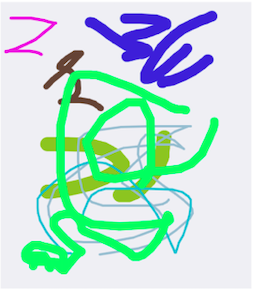
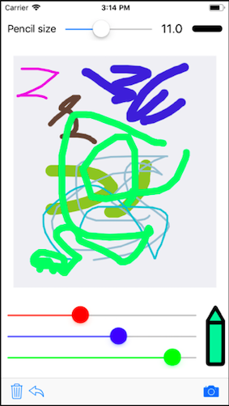

# MBDrawingView
This is free and drawing iOS **UIView** component that can be used fot free hand drawing. This gives you feature like different ***pencil sizes*** and ***colors*** on same drawing pad. This give a feature like ***Undo***, ***clear*** and ***capture*** drawing as **Image**.



### Drawing features




## Installation

### CocoaPods

[CocoaPods](http://cocoapods.org) is a dependency manager for Cocoa projects. You can install it with the following command:

```bash
$ gem install cocoapods
```

To integrate ***MBDrawingView*** into your Xcode project using CocoaPods, specify it in your `Podfile`:

```ruby
target '<Your Target Name>' do
    pod 'MBDrawingView'
end
```

## How to Use
It is simple and easy to use, just add UIView on xib and assign [MBDrawingView](Source/MBDrawingView.swift) class in XIB and you are DONE.

### Basic Features

```swift
let drawingView = MBDrawingView()

// Set pencil size
drawingView.pencilSize = 4.0

// Set color
drawingView.pencilColor = UIColor.red

// Check view has drawing or not
if drawingView.hasDrawing { }

// Capture drawing as image
let image =  drawingView.capture()

// Undo the last drawing sequence
drawingView.undo()

// Clear Drawing
drawingView.clear()
```


## Licence

**[MIT](LICENSE)**